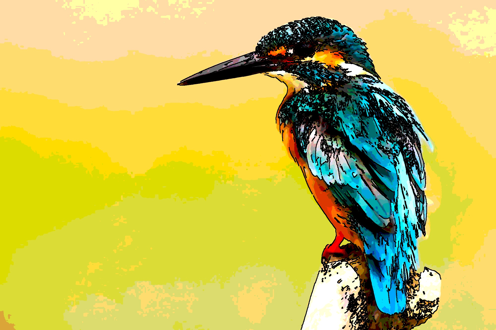

# 🎨 Image to Cartoon Converter (Basic Image Processing)

Turn your photos into **cartoon-style images** 🎭 using simple **image processing techniques** — no deep learning required, no dataset needed!  

We follow the algorithm described in:  
> **Shruti Kumari Shrivastava, Ruchi Gajjar**  
> *Image Processing based Image to Cartoon Generation: Reducing complexity of large computation arising from Deep Learning*  
> IEEE, 2023 International Conference on Computational Intelligence and Sustainable Engineering Solutions (CISES).  
> [DOI: 10.1109/CISES58720.2023.10183524]  

---

## ✨ Features
- 🧹 **Noise removal** with Median filter  
- ✂️ **Edge detection & enhancement** with Canny + Dilation  
- 🎨 **Color simplification** with Quantization  
- 🖼️ Outputs a **cartoon-like image** with bold edges and flat colors  
- ⚡ **Lightweight**: runs with OpenCV + NumPy, no GPU or training needed  

---

## 🧩 Algorithm Pipeline
Implementation strictly follows the algorithm proposed in the referenced paper:

1. **Input**: Original RGB image  
2. **Noise Removal** → Median Filter (removes salt & pepper noise)  
3. **Edge Detection** → Convert to grayscale + Canny Edge Detector  
4. **Edge Enhancement** → Morphological Dilation (thickens lines)  
5. **Image Smoothing** → Averaging Filter (reduces details for flat colors)  
6. **Color Quantization** →  
```
NewValue = floor(p / (a-b)) * (a+b)
```
(with constants `a` and `b` controlling number of color bins)  
7. **Combine** edges with quantized image → Final cartoon image  

---

## 📸 Example Results
(Replace placeholders with your own images in `/images` folder)

| Original | Edges | Cartoon Output |
|----------|-------|----------------|
|  |  |  |

---

## ⚙️ Installation & Usage

### Requirements
- Python 3.8+
- [OpenCV](https://pypi.org/project/opencv-python/)
- NumPy
- Matplotlib

Install dependencies:
```bash
pip install opencv-python numpy matplotlib
```

### Run Script

```bash
python cartoonizer.py
```

Edit the `image_path` variable in `cartoonizer.py` with your image, e.g.:

```python
image_path = "your_photo.jpg"
```

The output will be saved as:

```
your_photo_cartoon.png
```

---

## 📂 Project Structure

```
├── cartoonizer.py       # Main Python script
├── README.md            # Project documentation
├── images/              # Place before/after examples here
│   ├── original.jpg
│   ├── edges.jpg
│   └── cartoon.jpg
```

---

## 🌐 Google Colab Support

We also provide a **one-cell Google Colab notebook** for quick usage in the browser — upload your photo and get a cartoon instantly.

---

## 🚀 Roadmap

* ✅ Local Python script
* ✅ Google Colab support
* 🔜 Add a **frontend** (Tkinter / Streamlit / WebApp for uploads)
* 🔮 Explore **Deep Learning cartoonization** (AnimeGAN, CartoonGAN, NST)

---

## 📚 Reference

* Shruti Kumari Shrivastava, Ruchi Gajjar, *Image Processing based Image to Cartoon Generation: Reducing complexity of large computation arising from Deep Learning*, 2023 IEEE CISES.
  DOI: [10.1109/CISES58720.2023.10183524](https://doi.org/10.1109/CISES58720.2023.10183524)

---
